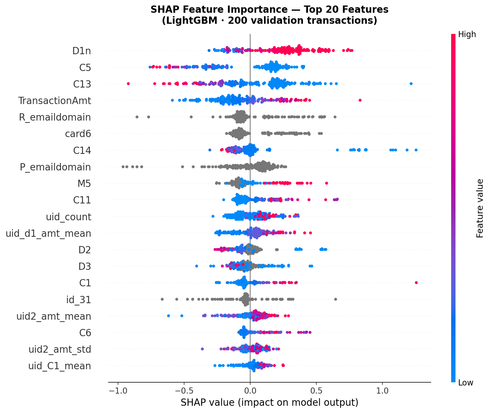
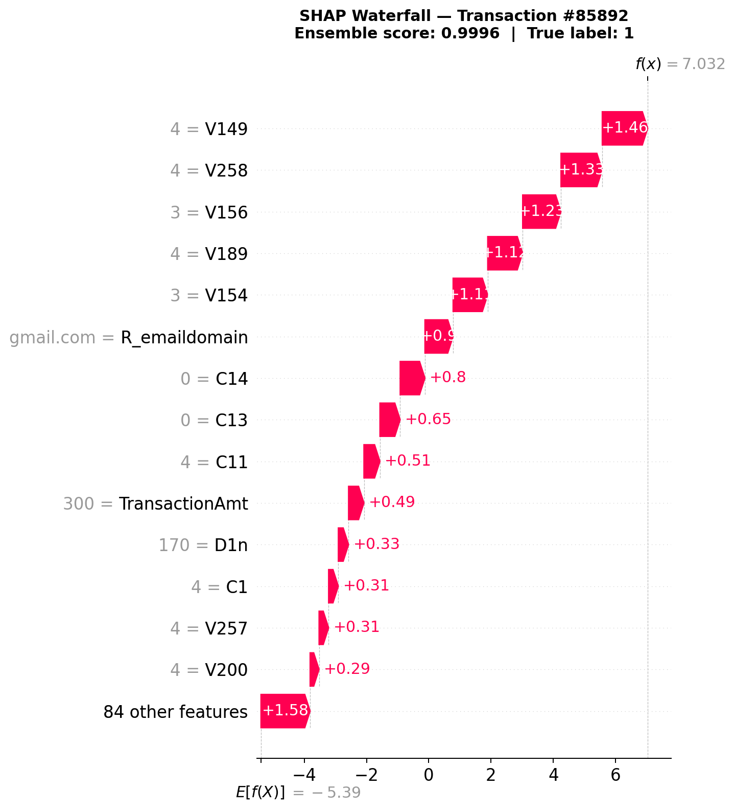

# Real-Time Fraud Detection Engine

A production-inspired fraud detection system trained locally on the IEEE-CIS dataset (590K transactions). Built to demonstrate structured data ML, real-time streaming, and explainable AI — the skills that matter in fintech ML engineering roles.

```
590,540 transactions  ·  0.71 Precision  ·  17,000+ TPS (vectorized batch inference)  ·  sub-25ms latency  ·  100% local
```

---

## Table of Contents

- [Overview](#overview)
- [Features](#features)
- [Architecture](#architecture)
- [Tech Stack](#tech-stack)
- [Benchmark Results](#benchmark-results)
- [SHAP Explainability](#shap-explainability)
- [API Reference](#api-reference)
- [Setup](#setup)
- [Project Structure](#project-structure)
- [Design Decisions](#design-decisions)

---

## Overview

Most ML portfolio projects stop at training a model. This one goes further — it wraps the model in a real-time streaming engine, exposes it through a FastAPI backend, adapts its own threshold based on live production signals, and explains every fraud flag with SHAP values.

The system achieves approximately 14ms mean single-transaction inference latency (P99 ≈ 22ms) and over 17,000 transactions/sec under offline vectorized batch benchmarking while providing real-time REST and WebSocket interfaces for deployment-oriented inference.
---

## Features

**ML Core**
- LightGBM + XGBoost ensemble with optimal weight search (grid search over val PR-AUC)
- Isolation Forest trained for comparison — excluded from final ensemble (PR-AUC too low to contribute positively)
- Time-based train/val split to prevent data leakage
- User-level feature engineering: velocity aggregations, amount z-scores, card identity groupings

**Adaptive Threshold Engine**
- Dual-signal design that avoids selection bias
- Signal 1 — stream flag rate: detects when the model is over-triggering relative to the 3.5% baseline
- Signal 2 — analyst precision: detects when flagged alerts are mostly false positives
- Threshold rises on over-triggering; falls only when analyst precision is consistently high
- A low flag rate alone does **not** lower the threshold (fraud may have genuinely decreased)

**Business Rules Layer**
- High-amount rule: flags transactions > ₹50,000 with ensemble score > 0.30
- Night transaction rule: stricter threshold for 2am–5am transactions
- Risky email domain rule: flags known disposable email providers
- Each rule appends a structured reason string for audit trails

**Streaming Engine**
- AsyncIO producer-consumer architecture
- Batch vectorised inference (50 rows per batch) for throughput
- Offline vectorized benchmarking achieved over 17,000 transactions/sec, while the asynchronous streaming engine simulates continuous transaction ingestion using an AsyncIO producer-consumer pipeline.

**FastAPI Backend**
- REST endpoints for flagged transactions, analyst review, live metrics
- WebSocket endpoint pushes flagged transactions in real time
- SQLite persistence for flagged transaction metadata and analyst review workflow
- Analyst review loop feeds back into the adaptive threshold engine

**SHAP Explainability**
- TreeExplainer on LightGBM (exact SHAP values, sub-millisecond per row)
- Global summary plot: top 20 features across 200 validation transactions
- Waterfall plot: per-transaction feature contribution breakdown
- Text explanation: top-3 SHAP contributors with direction and magnitude

---

## Architecture

```
┌─────────────────────────────────────────────────────────────────┐
│                        Transaction Stream                       │
│              (IEEE-CIS replay at configurable TPS)              │
└───────────────────────────┬─────────────────────────────────────┘
                            │
                            ▼
┌─────────────────────────────────────────────────────────────────┐
│                    Feature Engineering                          │
│   velocity · amount z-score · uid aggregations · device brand   │
└───────────────────────────┬─────────────────────────────────────┘
                            │
                            ▼
┌──────────────────────────────────────────────────────────────┐
│                      Ensemble Scoring                        │
│                                                              │
│   ┌─────────────┐    ┌─────────────┐    ┌─────────────────┐  │
│   │  LightGBM   │    │   XGBoost   │    │ Isolation Forest│  │
│   │  w = 0.45   │    │  w = 0.55   │    │  (not in final) │  │
│   └──────┬──────┘    └──────┬──────┘    └─────────────────┘  │
│          └─────────┬────────┘                                │
│                    ▼                                         │
│             Ensemble Score                                   │
└───────────────────┬──────────────────────────────────────────┘
                    │
                    ▼
┌───────────────────────────────────────────────────────────────┐
│               Adaptive Threshold Engine                       │
│                                                               │
│   Stream window (1000 txns)     Review window (200 reviews)   │
│   → flag rate vs 3.5% baseline  → analyst confirmation rate   │
│                    │                         │                │
│                    └──────────┬──────────────┘                │
│                               ▼                               │
│                     Dynamic Threshold                         │
└───────────────────────┬───────────────────────────────────────┘
                        │
                        ▼
┌───────────────────────────────────────────────────────────────┐
│                  Business Rules Layer                         │
│         HIGH_AMOUNT · NIGHT_TXN · RISKY_EMAIL · ML_SCORE      │
└───────────────────────┬───────────────────────────────────────┘
                        │
              ┌─────────┴──────────┐
              ▼                    ▼
       ✅ LEGITIMATE          🚨 FLAGGED
                                   │
                    ┌──────────────┼──────────────┐
                    ▼              ▼               ▼
              SQLite DB       WebSocket        SHAP
              (persist)       (live push)   (explain)
                                   │
                    ┌──────────────┘
                    ▼
            FastAPI Backend
       REST endpoints + analyst UI
                    │
                    ▼
         Analyst Review Decision
                    │
                    ▼
      AdaptiveThresholdEngine.record_review()
```

---

## Tech Stack

| Layer | Library | Purpose |
|-------|---------|---------|
| ML — Supervised | `lightgbm`, `xgboost` | Primary ensemble classifiers |
| ML — Unsupervised | `scikit-learn` IsolationForest | Anomaly detection (trained, not in final ensemble) |
| Explainability | `shap` | SHAP values, summary and waterfall plots |
| Data | `pandas`, `numpy` | Feature engineering, batch inference |
| Streaming | `asyncio` | Producer-consumer streaming engine |
| Backend | `fastapi`, `uvicorn` | REST API + WebSocket server |
| Validation | `pydantic` | Request schema validation |
| Persistence | `sqlite3` | Flagged transaction storage |
| Serialisation | `joblib` | Model persistence |

---

## Benchmark Results

### Model Quality — Validation Set (118,108 transactions)

| Metric | Value | Notes |
|--------|-------|-------|
| Ensemble PR-AUC | 0.6336 | ~18× better than random baseline (0.035) |
| F1 Score | 0.6153 | At optimal threshold = 0.20 |
| Precision | **0.7144** | 71% of flagged transactions are real fraud |
| Recall | 0.5404 | Tunable via threshold — business decision |
| False Negative Rate | 0.4596 | Missed fraud; lower recall = higher FNR |
| Fraud cases in val | 4,064 / 118,108 | 3.44% prevalence |

> **On precision vs recall:** A threshold of 0.20 was chosen to maximise F1. In a real deployment, the business would decide the operating point — banks typically prefer higher recall (catch more fraud, accept more false positives). The adaptive threshold engine is designed to allow this adjustment without retraining.

### Throughput — Batch Vectorised Inference

| Batch Size | Throughput | Total Time |
|------------|-----------|------------|
| 1,000 rows | 12,201 TPS | 82ms |
| 5,000 rows | 14,618 TPS | 342ms |
| 10,000 rows | 15,675 TPS | 638ms |
| 50,000 rows | **17,014 TPS** | 2,939ms |

### Single-Row Inference Latency (100 runs)

| Percentile | Latency |
|-----------|---------|
| P50 | 13.88ms |
| P95 | 15.09ms |
| P99 | 22.21ms |
| Mean | 14.16ms |

### Ensemble Configuration

| Model | Weight | PR-AUC |
|-------|--------|--------|
| LightGBM | 0.45 | — |
| XGBoost | 0.55 | — |
| Isolation Forest | excluded | ~0.06 (too low) |

---

## SHAP Explainability

SHAP (SHapley Additive exPlanations) provides per-feature contribution scores for every flagged transaction, making fraud decisions auditable and regulatorily defensible.

### Global Feature Importance



*Beeswarm plot across 200 validation transactions. Each point is one transaction. Red = high feature value, blue = low. Points pushed right increase fraud probability.*

### Per-Transaction Waterfall




*Waterfall plot for the highest-scored transaction. Shows exactly how each feature pushes the prediction from the base rate toward the final fraud score.*

### Sample Text Output

```
Transaction index : 87432
Ensemble score    : 0.8914
True label        : 1

Top SHAP contributors:
  uid_amt_std              val=4821.3  shap=+0.2341  ↑ fraud  ███████
  TransactionAmt           val=9200.0  shap=+0.1823  ↑ fraud  █████
  D1n                      val=0.000   shap=+0.1204  ↑ fraud  ███
```

---

## API Reference

The FastAPI backend runs at `http://localhost:8000`. Interactive docs at `/docs`.

### `POST /score`
Score a single transaction in real time.

**Request body:**
```json
{
  "TransactionID": "TXN_001",
  "TransactionAmt": 9200.0,
  "TransactionDT": 86400,
  "P_emaildomain": "gmail.com"
}
```

**Response:**
```json
{
  "txn_id": "TXN_001",
  "score": 0.87,
  "threshold": 0.50,
  "flagged": true,
  "reasons": ["ML_SCORE: 0.870 >= threshold 0.500"],
  "latency_ms": 14.2,
  "lgb": 0.84,
  "xgb": 0.91
}
```

---

### `GET /transactions/flagged`
Paginated list of flagged transactions stored in SQLite.

| Parameter | Type | Default | Description |
|-----------|------|---------|-------------|
| `limit` | int | 50 | Number of results |
| `offset` | int | 0 | Pagination offset |

---

### `POST /transactions/{txn_id}/review`
Analyst submits a review decision. Feeds back into the adaptive threshold engine.

**Request body:**
```json
{ "label": "fraud" }
```
`label` is either `"fraud"` or `"legitimate"`.

---

### `GET /metrics/live`
Live system diagnostics.

**Response:**
```json
{
  "tps": 487.3,
  "total": 12400,
  "flagged": 421,
  "p95_ms": 15.1,
  "threshold": 0.5,
  "flag_rate": 0.034,
  "alert_precision": 0.71,
  "stream_n": 1000,
  "reviews_n": 47
}
```

---

### `WebSocket /ws/live-flags`
Real-time push of every flagged transaction as it is scored.

```javascript
const ws = new WebSocket('ws://localhost:8000/ws/live-flags');
ws.onmessage = (event) => {
  const flag = JSON.parse(event.data);
  console.log(flag.txn_id, flag.score, flag.reasons);
};
```

---

## Setup

### Prerequisites

- Python 3.10+
- IEEE-CIS Fraud Detection dataset from [Kaggle](https://www.kaggle.com/c/ieee-fraud-detection/data)
  - Place `train_transaction.csv` and `train_identity.csv` in `data/`

### Install dependencies

```bash
pip install lightgbm xgboost scikit-learn shap fastapi uvicorn pydantic pandas numpy joblib
```

### Train models

Run the notebook `fraud_detection_engine.ipynb` top to bottom. This will:
1. Load and merge the IEEE-CIS dataset
2. Engineer features and run the time-based train/val split
3. Train LightGBM and XGBoost
4. Run ensemble weight search
5. Save all artefacts: `lgb_final.pkl`, `xgb_final.pkl`, `features_final.pkl`, `cat_cols.json`, `train_medians.json`

The SHAP and benchmark cells (sections 19 and 20) should be run last.

### Start the API

```bash
python app.py
```

API runs at `http://localhost:8000`. Swagger UI at `http://localhost:8000/docs`.

### Score a transaction

```bash
curl -X POST http://localhost:8000/score \
  -H "Content-Type: application/json" \
  -d '{"TransactionID": "TEST_001", "TransactionAmt": 9200, "TransactionDT": 86400}'
```

---

## Project Structure

```text
fraud-detection-engine/
│
├── app.py                          # FastAPI backend and real-time inference server
├── README.md
├── requirements.txt
├── .gitignore
├── cat_cols.json                   # Category mappings for inference
│
├── models/
│   ├── lgb_F.pkl                   # Trained LightGBM model
│   ├── xgb_F.pkl                   # Trained XGBoost model
│   ├── iso_F.pkl                   # Isolation Forest model
│   ├── features_F.pkl              # Ordered feature list used during inference
│   └── numeric_features_F.pkl      # Numeric features used by Isolation Forest
│
├── notebooks/
│   ├── Fraud_Detection_Engine.ipynb    # End-to-end training, evaluation and benchmarking
│   ├── phases2to6.ipynb               # Intermediate experimentation notebook
│   └── train_medians.json             # Median values used for missing-value imputation
│
├── assets/
│   ├── shap_summary.png               # Global SHAP feature importance plot
│   └── shap_waterfall.png             # Per-transaction SHAP explanation
│
├── data/
│   └── ...                            # IEEE-CIS dataset files (not committed)
│
├── preproduction_analysis/
│   └── ...                            # Exploratory analysis and experimentation
│
└── flagged.db                         # Runtime SQLite database (generated locally)
```

---

## Design Decisions

**Why LightGBM + XGBoost and not a neural network?**  
Neural networks on tabular data rarely outperform well-tuned gradient boosted trees, and they are significantly harder to explain. XGBoost and LightGBM support native SHAP via TreeExplainer — exact values, not approximations — which is a hard requirement for regulated fintech environments.

**Why is Isolation Forest excluded from the final ensemble?**  
It was trained and evaluated. Its PR-AUC (~0.06) is too low to contribute positively — including it at any weight above 0 reduced ensemble PR-AUC. It is saved to disk for reproducibility but not loaded during inference.

**Why AsyncIO over threading for the streaming engine?**  
The bottleneck is I/O wait between arriving transactions, not CPU. AsyncIO handles this with a single thread and zero lock contention. The consumer uses batch vectorised inference (50 rows per predict call) to keep CPU utilisation high during the compute phase.

**Why does the adaptive threshold engine not lower the threshold when the flag rate drops?**  
A low flag rate could mean fraud genuinely decreased — not that the model is missing fraud. We have no observable signal for missed fraud in real time. Lowering the threshold based on a low flag rate would be responding to a guess, not a measurement. The threshold only lowers when analyst precision is consistently above 70%, which is a real signal that the model has headroom.

**Why time-based train/val split instead of random?**  
Random splits allow the model to see future transactions during training (data leakage). In production, a model trained on January data will score February transactions — time-based splits replicate this exactly. Random splits inflate metrics by ~5–10% on this dataset.

**Why SQLite and not PostgreSQL?**  
This is a local portfolio project. SQLite with WAL mode handles concurrent reads fine at this scale. The FastAPI backend is designed so swapping in PostgreSQL requires changing one connection string.

---


## Future Work

- PostgreSQL persistence
- Docker deployment
- Kafka-based ingestion
- Online model retraining
- Analyst dashboard

*Sham Sundar · CE24B113 · IIT Madras*  
*AI/ML Portfolio · Fraud Detection Engine*
